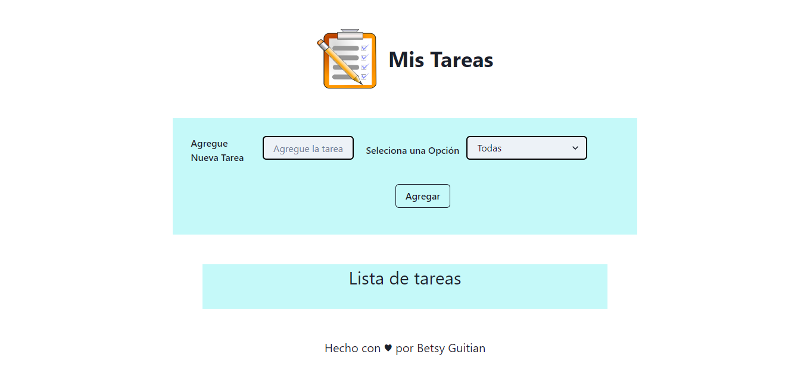

# To Do List

To Do List es el proyecto final del modulo 6 de la carrera "Desarrollo Front-end" dictada por ADA ITW.

Esta app está realizada con React (JavaScript), desarrollado con Chakra y Vite.

El proyecto terminado puede verse en este enlace [link](to-do-lists-omega.vercel.app/).

 - Los datos se almacenan en el localStorage, mantiendo actualizada la info y los datos a cada momento.

  - Las tareas se podrán marcar como completas o desmarcar si están incompletas.

  - Hay un select que permite filtrar las notas/tareas y muestra según lo seleccionado, las que estan completas, incompletas o todas. 

  - Se pueden eliminar las tareas que ya no se necesiten.

 
  

 ## Es una aplicación para control de Tareas.
 

Podrás agregar tareas, marcar como completas o incompletas, filtrarlas.<em> Ideal para anotar todo lo que tengas que hacer y no te olvides de nada.</em>

 

 

Cargando una lista de tareas
.png)

 

Eliminando una tarea
.png)

 

Marcando tareas como listas
.png)

 

Tambien se pueden filtrar por completas o imcompletas
.png)

 

## _Contacto_
Acá mis Redes Sociales, si queres contactarme:
* <a href="http://wa.me/541134277653">Whatsapp</a>
* <a href="http://github.com/betsynohe">Github</a>
* <a href="http://www.linkedin.com/in/betsy-guitian-b36b06242/">Linkedin</a>
* <a href="mailto:betsyguitian@gmail.com">E-mail</a>